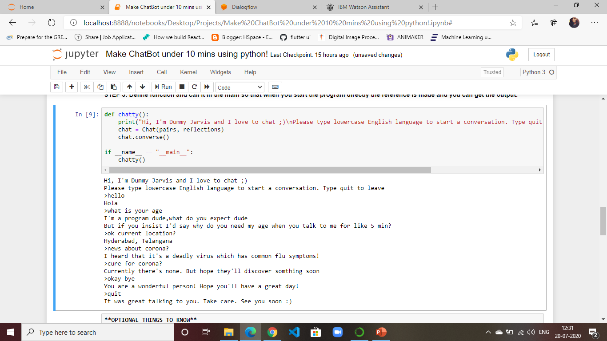

# Chatbot-using-python-in-under-10mins
Make a ChatBot using Python. All we have to do is use NLTK library to make an interactive bot.
This is done in 3 steps:
1. Importing the libraries
2. Generating the pairs
3. Define main function

And the output will be:
A chat interface-

And here's optional information you wanna know:

